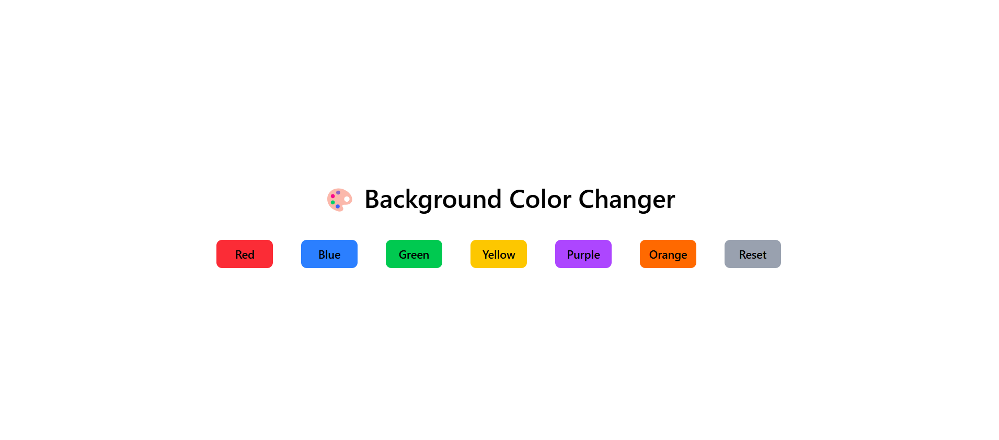

# 🎨 React Background Color Changer


A clean, interactive, and responsive web application built with **React.js**. It allows users to instantly switch the background color of the UI using dynamic state management, providing a smooth user experience.

---

## 📸 Project Preview

(./)

---

## ✨ Key Features

- **🎨 Dynamic UI Updates:** Instantly changes the background color without reloading the page.
- **⚡ React Hooks:** Built using the powerful `useState` hook for efficient state management.
- **📱 Fully Responsive:** Styled completely with Tailwind CSS ensuring it looks great on all devices.
- **🌊 Smooth Transitions:** Uses CSS transitions for an elegant, fading effect when switching colors.
- **🔄 Reset Functionality:** Includes a reset button to easily revert to the default theme.

---

## 🛠️ How It Was Made (Tech Stack & Logic)

- **Frontend:** React.js (Functional Components)
- **Styling:** Tailwind CSS
- **Logic Details:** The application initializes a `color` state variable using `useState('white')`. Each button is equipped with an `onClick` event handler that passes a specific hex code or color name to the `setColor` function. The main wrapper `div` uses inline styling `style={{ backgroundColor: color }}` to dynamically inject the state value, instantly updating the UI.

---
 
## 💻 How to Run Locally

Follow these steps to run the project locally:

# 1. Clone the repository
```bash
git clone https://github.com/Ayesha-Saddique9/react-bg-color-changer.git
```

# 2. Navigate to the project folder
```bash
cd react-bg-color-changer
```
# 3. Install the required dependencies
```bash
npm install
```
# 4. Start the local development server
```bash
npm run dev
```
## 👩‍💻 Author

**Ayesha Saddique**  
Junior Frontend Web Developer  

🔗 GitHub: https://github.com/Ayesha-Saddique9  

⭐ If you like this project, feel free to give it a star!

